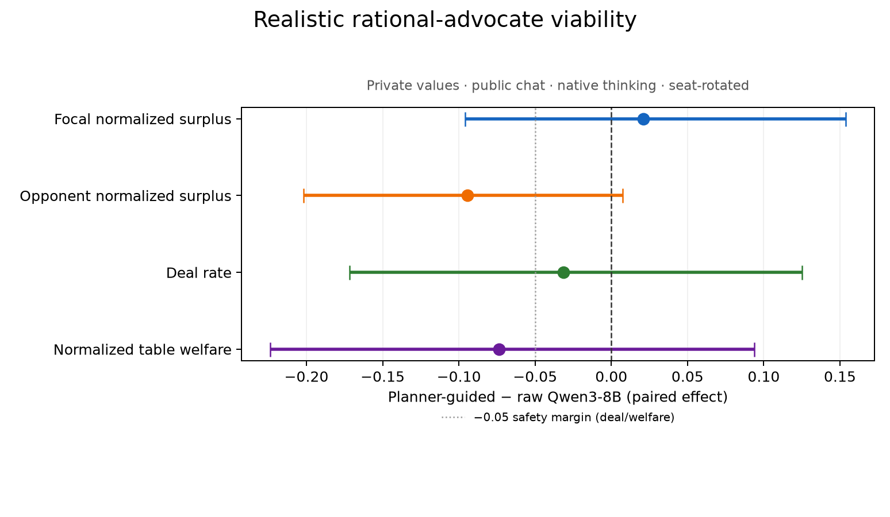

# Realistic planner-guided advocate viability pilot

Strict validation passed for **96 episodes** and **64 paired focal-seat comparisons**.

| Paired outcome (guided − raw) | Estimate | 95% instance-bootstrap CI |
|---|---:|---:|
| Focal normalized surplus | +0.021 | [-0.096, +0.154] |
| Opponent normalized surplus | -0.094 | [-0.202, +0.007] |
| Deal rate | -0.031 | [-0.172, +0.125] |
| Normalized table welfare | -0.074 | [-0.224, +0.094] |

| Condition | Deal rate | Focal surplus | Opponent surplus | Table welfare |
|---|---:|---:|---:|---:|
| Raw Qwen3-8B | 0.812 | 0.422 | 0.422 | 0.843 |
| Planner-guided Qwen3-8B | 0.781 | 0.442 | 0.327 | 0.770 |

| Focal seat | Focal-surplus effect | 95% instance-bootstrap CI |
|---:|---:|---:|
| 0 | +0.073 | [-0.083, +0.248] |
| 1 | -0.031 | [-0.213, +0.158] |

**RL-example viability gate: FAIL.**

The planner is an advocate, not an omniscient mediator: it optimizes the focal participant's captured surplus using only that participant's private sheet and public proposals/votes. Nash/social welfare is a non-inferiority safety constraint, not the optimized target. Public chat and binding actions are in the transcripts; exact model-conditioned views, private scratchpads/native reasoning, and per-turn planner candidate tables are in the episode JSON files indexed by `episodes.csv`.
`example_index.json` ranks all 64 matched comparisons by focal-surplus improvement and links both the guided and raw episode JSON plus Markdown/HTML transcripts. It is the audit-first starting point for any later SFT/preference-pair curation; absolute high-scoring but non-improving games are not promoted.

## Hidden-preference recovery

- Opponent proposals observed by the final focal decision: 2.23 on average
- Final usable issue-pairwise accuracy: 0.466
- Gain over the exact prior: +0.029
- Gain in posterior mass on the true top issue: +0.002
- Reservation-threshold absolute error: 0.053; reduction from prior: -0.005

`belief_recovery.csv` reconstructs only the posterior available at the focal agent's last decision point from its own exact stored view. It is compared post-hoc with the hidden opponent sheet; hidden values never enter the live planner.

The opponent-surplus contrast distinguishes extraction from mutual expansion: a focal gain paired with an opponent loss is transfer/lowballing; gains for both indicate logrolling. It is descriptive and does not change the preregistered focal-surplus and non-inferiority gates.
At the matched-pair level, guidance created 7 agreements and lost 9; among 43 pairs where both conditions reached a deal, 10 show focal-up/opponent-down transfer and 0 show both parties improving.
