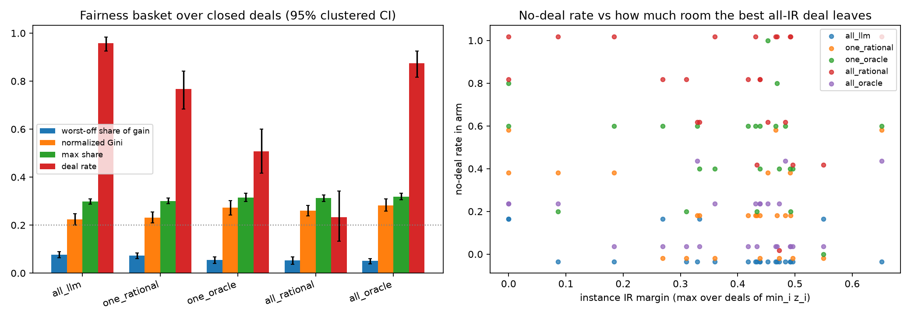

# Five-seat private-information campaign

> ## ⚠ ERRATUM (2026-08-10) — the oracle arms' CLOSURE numbers on this page are measured on an agent with a spoiled ballot
>
> The omniscient seat cast its **forced-final** vote on whichever live offer it valued most instead of the one
> offer under the up/down vote. The protocol rejects that as a legality error, the seat repeats itself on its
> single retry, and the turn is recorded as a **pass** — a silent abstention. It consumed **94 of 107 (87.9%)**
> of `all_oracle`'s forced-final turns, touching **every one** of its 15 no-deals, and **114 of 334 (34.1%)** of
> `one_oracle`'s, touching 57 of its 59. The `all_llm`, `one_rational` and `all_rational` arms are unaffected
> (`all_rational` 0 of 476 — its terminal vote reads the standing offer).
>
> Re-running `all_oracle` on the identical 120 games with the ballot repaired: **deal rate 0.875 → 1.000**,
> **score 0.791 → 0.907**, paired score gain vs all-LLM **−0.082 → +0.034 [+0.001, +0.074]** — a sign flip.
> Rows below marked *(spoiled ballot)* are kept as the record of what was computed; the **repaired** rows are
> the ones to read. `one_oracle`'s re-run needs API budget and is in flight; its rows are flagged but not yet
> corrected.
>
> Full account: research note **0045**; repair commit `ca20157`. The distributional finding is unchanged —
> see the fairness-basket erratum in note 0043 — and is in fact cleaner, because the repaired `all_oracle`
> now closes **more** often than all-LLM (+0.042 [+0.017, +0.075]) and still splits worse on every column.

All intervals are 95% instance-clustered bootstrap intervals; no-deal scores zero.

| logical arm | n | normalized score [95% CI] | deal rate [95% CI] | paired score gain vs all-LLM | among-deals mean score (median, IQR) | among-deals per-party z: mean [95% CI], median, IQR |
|---|---:|---:|---:|---:|---:|---:|
| all_llm | 120 | 0.873 [0.833, 0.910] | 0.958 [0.925, 0.992] | reference | 0.911 (0.946, [0.838, 1.000]) n=115 | 0.653 [0.620, 0.690], 0.667, [0.433, 1.000] |
| one_rational | 120 | 0.686 [0.613, 0.759] | 0.767 [0.692, 0.842] | -0.186 [-0.267, -0.106] | 0.895 (0.931, [0.825, 1.000]) n=92 | 0.639 [0.605, 0.675], 0.657, [0.431, 1.000] |
| one_oracle *(spoiled ballot; re-run in flight)* | 120 | 0.461 [0.377, 0.544] | 0.508 [0.417, 0.600] | -0.412 [-0.493, -0.323] | 0.906 (0.979, [0.854, 1.000]) n=61 | 0.654 [0.618, 0.691], 0.688, [0.360, 1.000] |
| all_rational | 120 | 0.189 [0.110, 0.278] | 0.233 [0.133, 0.342] | -0.684 [-0.786, -0.580] | 0.809 (0.830, [0.699, 0.922]) n=28 | 0.554 [0.512, 0.611], 0.567, [0.329, 0.762] |
| all_oracle *(spoiled ballot — superseded)* | 120 | 0.791 [0.734, 0.842] | 0.875 [0.817, 0.925] | -0.082 [-0.146, -0.022] | 0.904 (0.963, [0.841, 1.000]) n=105 | 0.643 [0.614, 0.673], 0.674, [0.316, 1.000] |
| **all_oracle — ballot repaired** | 120 | **0.907 [0.880, 0.933]** | **1.000 [1.000, 1.000]** | **+0.034 [+0.001, +0.074]** | 0.907 (0.982, [0.843, 1.000]) n=120 | 0.645 [0.611, 0.681], 0.684, [0.310, 1.000] |

Both among-deals columns condition on a closed deal (per-arm deal counts beside them — the standing censoring caveat applies: each arm's closed set is self-selected, and a low-deal-rate arm's column describes a different, easier subset of games). The score column is the episode-level ceiling-normalized score; the per-party z column pools party-observations (each closed deal contributes its five z_i = (u_i − τ_i)/c_i; no per-deal averaging first), with an instance-clustered bootstrap CI on the mean and plain empirical quartiles. Four of five arms land within 0.016 of each other on among-deals score (0.895–0.911) and within 0.015 on per-party z (0.639–0.654); only `all_rational` is materially lower on both (0.809 score, 0.554 z, the widest IQRs), so essentially the entire between-arm spread of the unconditional headline column is the deal-rate column, not deal quality.

Direct all-rational minus one-rational paired normalized-score effect: -0.498 [-0.590, -0.404] (positive favors five rational agents).

## Difficulty-tag strata

Paired normalized-score effects versus all-LLM:

| tag | one rational [95% CI] | n pairs |
|---|---:|---:|
| easy | -0.096 [-0.197, 0.027] | 40 |
| hard | -0.342 [-0.435, -0.259] | 40 |
| high-conflict | -0.220 [-0.327, -0.110] | 30 |
| large-frontier | -0.149 [-0.364, 0.066] | 30 |
| medium | -0.120 [-0.274, 0.010] | 40 |
| no-clear-win-win | -0.305 [-0.466, -0.143] | 30 |
| pivotal-seat | -0.356 [-0.467, -0.260] | 30 |
| small-frontier | -0.130 [-0.271, 0.027] | 30 |

Selected complete-episode API cost: $461.28.
Campaign ledger spend (including failed/retried attempts): $466.61 of $1800.00.

Difficulty correlations are descriptive and stored with their per-instance points in `summary.json`.

---

## Fairness basket and correct-walk credit (added 2026-08-09)

Appended by the results-review lane; see research note 0043 (`experiments/rational_agents/research-notes/0043-five-arm-fairness-basket-and-correct-walks.md`) for the reading. Computed by `analyze_five_seat_fairness_basket.py` from the same frozen episode artifacts as the tables above; all 600 rows reproduce the published columns exactly. No API calls, $0 spend.

_Left: the basket over closed deals, dotted line at the 0.200 equal-split reference. Right: each point is one instance in one arm, with a small per-arm vertical offset so overlapping points stay visible; horizontal position (IR margin) is exact._

All intervals are 95% cluster bootstraps (10000 resamples) over the 24 parameter sets, each set's five seeds resampled together. Paired contrasts join on `(instance_id, episode_seed)`.

### Fairness basket — conditional on a closed deal

Every column below is computed over closed deals only, so `deal rate` is carried beside them: an arm that closes 28 of 120 deals is describing a self-selected set of games, not the same games. Normalized coordinate z_i = (u_i − tau_i)/c_i with c_i the party's best surplus on the individually rational set (affine-invariant per party).

| arm | n | deal rate | below-thr. accept | worst-off z | worst-off share | dist-NBS | dist-KS | norm. Gini | norm. Nash welf. | max share |
|---|---:|---:|---:|---:|---:|---:|---:|---:|---:|---:|
| `all_llm` | 120 | 0.958 [0.925, 0.983] | 0.000 [0.000, 0.000] | 0.257 [0.207, 0.306] | 0.077 [0.064, 0.090] | 0.464 [0.357, 0.583] | 0.398 [0.316, 0.474] | 0.223 [0.200, 0.247] | 0.535 [0.459, 0.602] | 0.299 [0.288, 0.309] |
| `one_rational` | 120 | 0.767 [0.683, 0.842] | 0.000 [0.000, 0.000] | 0.239 [0.197, 0.282] | 0.073 [0.061, 0.084] | 0.444 [0.343, 0.568] | 0.414 [0.332, 0.491] | 0.231 [0.209, 0.255] | 0.506 [0.440, 0.564] | 0.301 [0.289, 0.313] |
| `one_oracle` | 120 | 0.508 [0.417, 0.600] | 0.000 [0.000, 0.000] | 0.187 [0.131, 0.248] | 0.054 [0.040, 0.068] | 0.549 [0.421, 0.689] | 0.479 [0.366, 0.587] | 0.272 [0.241, 0.302] | 0.472 [0.386, 0.551] | 0.314 [0.298, 0.333] |
| `all_rational` | 120 | 0.233 [0.133, 0.342] | 0.000 [0.000, 0.000] | 0.147 [0.103, 0.194] | 0.052 [0.037, 0.067] | 0.600 [0.500, 0.680] | 0.590 [0.521, 0.649] | 0.261 [0.238, 0.283] | 0.408 [0.316, 0.485] | 0.314 [0.299, 0.327] |
| `all_oracle` *(spoiled ballot — superseded)* | 120 | 0.875 [0.817, 0.925] | 0.000 [0.000, 0.000] | 0.172 [0.128, 0.216] | 0.050 [0.039, 0.061] | 0.621 [0.523, 0.736] | 0.545 [0.458, 0.630] | 0.283 [0.258, 0.308] | 0.422 [0.340, 0.498] | 0.319 [0.305, 0.334] |
| **`all_oracle` — ballot repaired** | 120 | **1.000 [1.000, 1.000]** | 0.000 [0.000, 0.000] | 0.166 [0.118, 0.220] | 0.048 [0.037, 0.061] | 0.631 [0.520, 0.756] | 0.549 [0.449, 0.649] | 0.285 [0.256, 0.314] | 0.406 [0.316, 0.491] | 0.319 [0.303, 0.336] |

Lower is better for below-threshold accept, dist-NBS, dist-KS, Gini, and max share; higher is better for worst-off z, worst-off share, and normalized Nash welfare. An equal split puts worst-off share at 0.200 and max share at 0.200.

### Per-party normalized surplus among closed deals (added 2026-08-10)

Pooling: party-observations — each closed deal contributes its five z_i as five observations (no per-deal averaging first). The mean carries an instance-clustered bootstrap CI; the quartiles are plain empirical quantiles of the same pooled distribution, descriptive only. Conditional on a closed deal, so read beside the arm's deal rate.

| arm | deals | deal rate | per-party z mean [95% CI] | median | IQR |
|---|---:|---:|---:|---:|---:|
| `all_llm` | 115/120 | 0.958 | 0.653 [0.620, 0.690] | 0.667 | [0.433, 1.000] |
| `one_rational` | 92/120 | 0.767 | 0.639 [0.605, 0.675] | 0.657 | [0.431, 1.000] |
| `one_oracle` | 61/120 | 0.508 | 0.654 [0.618, 0.691] | 0.688 | [0.360, 1.000] |
| `all_rational` | 28/120 | 0.233 | 0.554 [0.512, 0.611] | 0.567 | [0.329, 0.762] |
| `all_oracle` | 105/120 | 0.875 | 0.643 [0.614, 0.673] | 0.674 | [0.316, 1.000] |

### Unconditional companions

`below-thr. episode` counts a no-deal episode as 0 rather than dropping it, so it is the rate at which an arm's episodes END in an individually irrational agreement.

| arm | n | deal rate | below-thr. episode | normalized score | norm. Nash welf. (uncond.) |
|---|---:|---:|---:|---:|---:|
| `all_llm` | 120 | 0.958 [0.925, 0.983] | 0.000 [0.000, 0.000] | 0.873 [0.833, 0.910] | 0.512 [0.430, 0.586] |
| `one_rational` | 120 | 0.767 [0.683, 0.842] | 0.000 [0.000, 0.000] | 0.686 [0.613, 0.761] | 0.388 [0.320, 0.452] |
| `one_oracle` | 120 | 0.508 [0.417, 0.600] | 0.000 [0.000, 0.000] | 0.461 [0.377, 0.548] | 0.240 [0.173, 0.312] |
| `all_rational` | 120 | 0.233 [0.133, 0.342] | 0.000 [0.000, 0.000] | 0.189 [0.111, 0.278] | 0.095 [0.050, 0.145] |
| `all_oracle` | 120 | 0.875 [0.817, 0.925] | 0.000 [0.000, 0.000] | 0.791 [0.734, 0.842] | 0.370 [0.286, 0.450] |

### Paired fairness contrasts vs `all_llm`

On the conditional columns a pair contributes only when BOTH arms closed a deal on that `(instance, seed)`; the pair count is reported because it falls sharply for the low-deal-rate arms.

| arm | deal rate | below-thr. accept | worst-off z | worst-off share | norm. Gini | max share |
|---|---:|---:|---:|---:|---:|---:|
| `one_rational` | -0.192 [-0.275, -0.108] (n=120) | 0.000 [0.000, 0.000] (n=90) | -0.011 [-0.043, 0.020] (n=90) | -0.004 [-0.015, 0.006] (n=90) | 0.005 [-0.016, 0.026] (n=90) | 0.000 [-0.009, 0.010] (n=90) |
| `one_oracle` | -0.450 [-0.542, -0.350] (n=120) | 0.000 [0.000, 0.000] (n=56) | -0.070 [-0.115, -0.029] (n=56) | -0.024 [-0.039, -0.010] (n=56) | 0.048 [0.019, 0.081] (n=56) | 0.018 [0.004, 0.034] (n=56) |
| `all_rational` | -0.725 [-0.833, -0.608] (n=120) | 0.000 [0.000, 0.000] (n=28) | -0.096 [-0.163, -0.024] (n=28) | -0.028 [-0.051, -0.005] (n=28) | 0.031 [-0.003, 0.068] (n=28) | 0.006 [-0.013, 0.022] (n=28) |
| `all_oracle` | -0.083 [-0.150, -0.017] (n=120) | 0.000 [0.000, 0.000] (n=101) | -0.075 [-0.118, -0.033] (n=101) | -0.024 [-0.037, -0.012] (n=101) | 0.055 [0.031, 0.080] (n=101) | 0.019 [0.006, 0.032] (n=101) |

### Correct-walk credit

**Every one of the 24 bank instances admits at least one weakly all-IR deal** (u_i ≥ tau_i for all five parties; IR-set sizes 4–47 of 256 deals). The discrete justified-walk fraction is therefore identically 0.000 in every arm and every stratum: **no no-deal episode in this campaign was a correct refusal of an infeasible game.** The metric charging zero for a walk is not, on this bank, charging zero for correct behaviour.

The continuous form carries what is left. The IR margin of an instance is max over deals of min_i z_i — how much room the best all-satisfying deal leaves the party it satisfies least. Across the bank it ranges 0.000–0.652 (mean 0.377). But feasibility is not comfortable everywhere: 3 of 24 instances sit at or below a 0.10 margin, and 2 of those are exactly 0.000 — the best all-satisfying deal in those games holds some party precisely at its threshold, so agreement is feasible on paper and knife-edge in practice. Those instances carry the tags hard, high-conflict, no-clear-win-win, pivotal-seat, small-frontier, which is the same corner of the bank the inverted difficulty gradient points at.

#### No-deal episodes by arm and difficulty tag

Each cell is `no-deals/episodes (justified walks)`, where a walk is justified only if its instance admits no all-IR deal. The walk-weighted mean IR margin of each cell is in `summary.json`.

| tag | `all_llm` | `one_rational` | `one_oracle` | `all_rational` | `all_oracle` |
|---|---:|---:|---:|---:|---:|
| easy | 2/40 (0 just.) | 6/40 (0 just.) | 20/40 (0 just.) | 20/40 (0 just.) | 6/40 (0 just.) |
| hard | 2/40 (0 just.) | 16/40 (0 just.) | 21/40 (0 just.) | 39/40 (0 just.) | 5/40 (0 just.) |
| high-conflict | 0/30 (0 just.) | 6/30 (0 just.) | 13/30 (0 just.) | 26/30 (0 just.) | 4/30 (0 just.) |
| large-frontier | 2/30 (0 just.) | 7/30 (0 just.) | 15/30 (0 just.) | 22/30 (0 just.) | 1/30 (0 just.) |
| medium | 1/40 (0 just.) | 6/40 (0 just.) | 18/40 (0 just.) | 33/40 (0 just.) | 4/40 (0 just.) |
| no-clear-win-win | 2/30 (0 just.) | 11/30 (0 just.) | 17/30 (0 just.) | 28/30 (0 just.) | 4/30 (0 just.) |
| pivotal-seat | 2/30 (0 just.) | 13/30 (0 just.) | 15/30 (0 just.) | 29/30 (0 just.) | 5/30 (0 just.) |
| small-frontier | 2/30 (0 just.) | 6/30 (0 just.) | 14/30 (0 just.) | 26/30 (0 just.) | 3/30 (0 just.) |

#### Bank IR margin by difficulty tag

| tag | instances | mean IR margin | min IR margin |
|---|---:|---:|---:|
| easy | 8 | 0.442 | 0.329 |
| hard | 8 | 0.297 | 0.000 |
| high-conflict | 6 | 0.354 | 0.086 |
| large-frontier | 6 | 0.430 | 0.310 |
| medium | 8 | 0.394 | 0.269 |
| no-clear-win-win | 6 | 0.320 | 0.000 |
| pivotal-seat | 6 | 0.236 | 0.000 |
| small-frontier | 6 | 0.331 | 0.000 |

#### Does no-deal track thin margins?

Per-arm Pearson correlation between an instance's IR margin and its no-deal rate in that arm (negative = failures concentrate where agreement was thinnest).

| arm | r(IR margin, no-deal rate) [95% CI] | instances |
|---|---:|---:|
| `all_llm` | -0.465 [-0.823, 0.089] | 24 |
| `one_rational` | -0.249 [-0.698, 0.308] | 24 |
| `one_oracle` | -0.140 [-0.516, 0.308] | 24 |
| `all_rational` | -0.256 [-0.545, 0.082] | 24 |
| `all_oracle` | -0.020 [-0.438, 0.380] | 24 |
